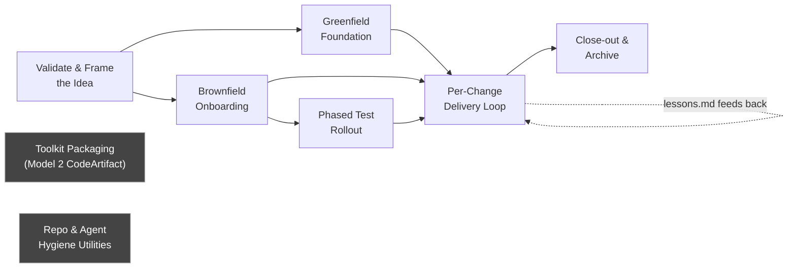
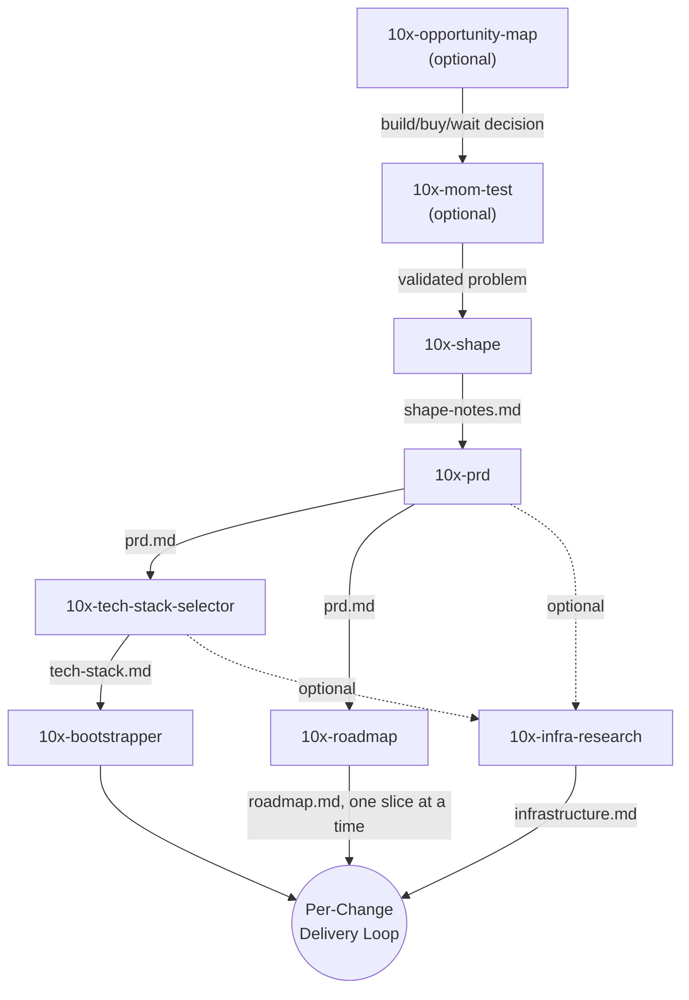
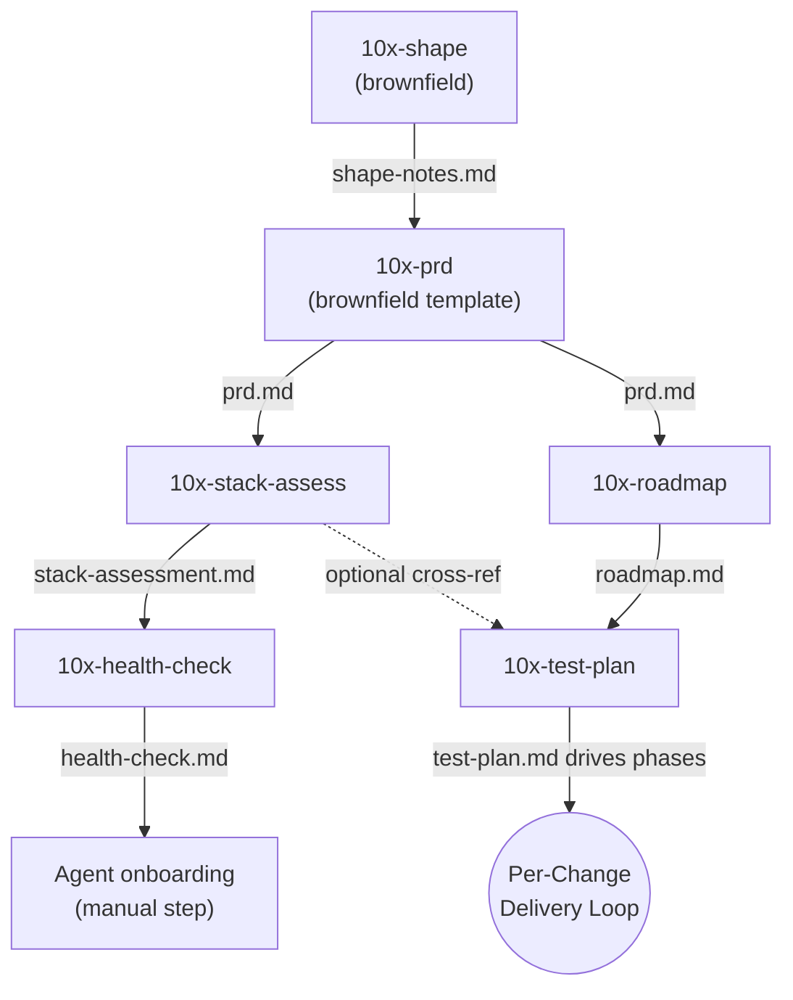
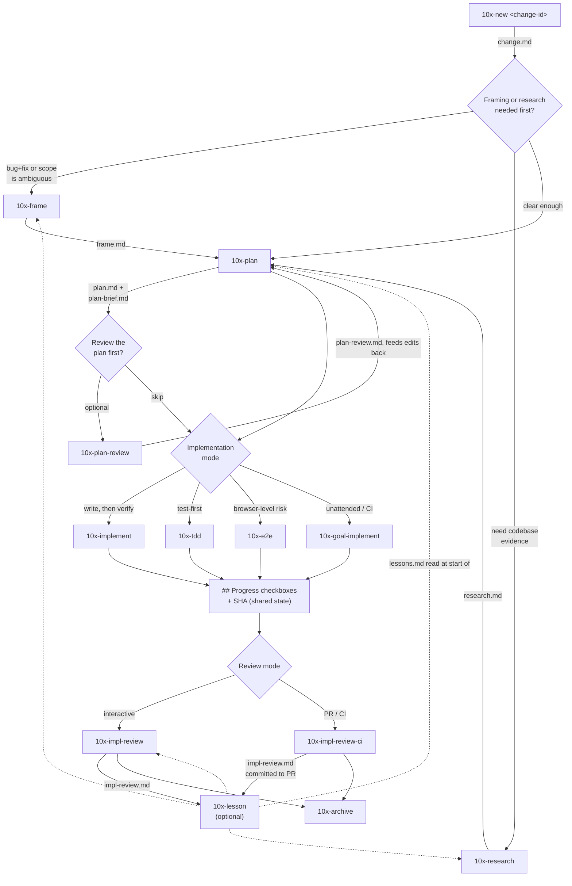
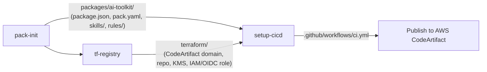

# 10x Skills — Workflow Guide

This repo's `.agents/skills/` directory holds 32 skills. They aren't independent
commands — most of them are links in a chain that talks to itself through files
written under `context/`. This guide maps the chains: where each workflow
**begins**, what happens **next**, and where it **ends**.

## How the chain model works

Every skill in the `context/` chain follows the same contract:

1. It reads an artifact another skill left on disk (or starts fresh if none exists).
2. It does its job — interview, research, generate, implement, review.
3. It writes its own artifact to `context/foundation/` or `context/changes/<change-id>/`.
4. It **stops**. It does not auto-invoke the next skill — it names it and lets you decide.

So "chaining" here means: *skill A's output file is skill B's expected input file*,
not "A calls B." You are the scheduler. This is why the diagrams below show file
artifacts as the edges, not function calls.

Three tracks share this repo but don't interconnect:

- **The SDLC track** (`context/foundation/`, `context/changes/`) — idea → shipped, reviewed, archived change. This is most of the catalog.
- **The toolkit packaging track** (`pack-init`, `setup-cicd`, `tf-registry`) — publishing *generated skills themselves* to a private npm registry. Unrelated to building product features.
- **Standalone utilities** — repo hygiene and tooling (`10x-agents-md`, `10x-rule-review`, `10x-cli-setup`, `10x-cli-guide`, `10x-init`) that can be run any time, chained into nothing.

---

## Quick decision table — "I want to…"D:\Repo\trade-with-me\.agents\prompts\skill-explainer.md

| I want to… | Start with | Notes |
|---|---|---|
| Sort a vague pain point into build/buy/wait before committing | `10x-opportunity-map` | Optional; routes to `10x-mom-test` → `10x-shape` |
| Check whether a problem is real before building | `10x-mom-test` | Optional pre-`10x-shape` validation gate |
| Turn a raw idea into a spec, from scratch | `10x-shape` → `10x-prd` | Greenfield or brownfield, auto-detected |
| Pick a tech stack for a new project | `10x-tech-stack-selector` | Requires `prd.md` on disk first |
| Scaffold the actual codebase | `10x-bootstrapper` | Requires `tech-stack.md` first |
| Assess whether an *existing* codebase is agent-friendly | `10x-stack-assess` → `10x-health-check` | Brownfield only |
| Decide what to build first from a PRD | `10x-roadmap` | Needs `prd.md`; outputs vertical slices |
| Pick a hosting/deploy platform | `10x-infra-research` | After PRD/tech-stack, before implementation |
| Start work on one specific change | `10x-new` | Creates the change folder everything else writes into |
| I have a "bug + fix" or a scope question, and I'm not sure the fix is right | `10x-frame` | Use *before* planning, not instead of it |
| I need codebase evidence before planning | `10x-research` | Feeds `10x-plan` |
| Turn a change into a step-by-step build plan | `10x-plan` | The default next step after `10x-new` |
| Sanity-check a plan before building it | `10x-plan-review` | Optional gate before `10x-implement` |
| Build a planned phase, write-then-verify | `10x-implement` | |
| Build a planned phase, test-first | `10x-tdd` | Sibling of `10x-implement` |
| Cover a browser-only / cross-boundary risk | `10x-e2e` | Sibling of `10x-implement`/`10x-tdd` |
| Run a plan unattended (headless / CI) | `10x-goal-implement` | Autonomous sibling of `10x-implement` |
| Review finished implementation against the plan | `10x-impl-review` | Interactive |
| Gate a PR automatically in CI | `10x-impl-review-ci` | Non-interactive CI counterpart |
| Record a recurring mistake so it stops repeating | `10x-lesson` | Read by nearly every other skill at start |
| Close out a finished, reviewed change | `10x-archive` | Terminal step |
| Systematically test-harden an existing product | `10x-test-plan` | Brownfield-only orchestrator, drives the change loop itself |
| Scaffold `context/` before anything else | `10x-init` | Optional — other skills self-bootstrap it |
| Write/refresh an AI-agent onboarding doc | `10x-agents-md` | Standalone, not chained |
| Score the quality of an existing CLAUDE.md/AGENTS.md | `10x-rule-review` | Standalone, read-only |
| Install/use the separate `10x-cli` tool | `10x-cli-setup` → `10x-cli-guide` | Unrelated to the skill chain |
| Publish generated skills as an npm package | `pack-init` → `setup-cicd` (+ `tf-registry`) | Separate "Model 2" track |

---

## Map of workflows

`G` and `H` are drawn separately on purpose — nothing in the SDLC track depends on
them, and they depend on nothing in it.

---

## 1. Greenfield foundation — idea to scaffolded repo

**Begins:** no artifacts exist yet, or you have a raw idea.
**Ends:** a running scaffold in the working directory, ready for the per-change loop.

| Step | Skill | Reads | Writes |
|---|---|---|---|
| 0 (optional) | `10x-opportunity-map` | freeform friction/signals | `context/team/opportunity-map.md` |
| 0 (optional) | `10x-mom-test` | opportunity-map / shape-notes / raw notes | `context/team/mom-test-validation.md` |
| 1 | `10x-shape` | nothing (entry point) | `context/foundation/shape-notes.md` |
| 2 | `10x-prd` | `shape-notes.md` | `context/foundation/prd.md` |
| 3 | `10x-tech-stack-selector` | `prd.md` | `context/foundation/tech-stack.md` |
| 4 | `10x-bootstrapper` | `tech-stack.md` | scaffolded project + verification log |
| 3b (optional) | `10x-roadmap` | `prd.md` | `context/foundation/roadmap.md` |
| 3c (optional) | `10x-infra-research` | `prd.md` / `tech-stack.md` | `context/foundation/infrastructure.md` |

Steps 3b and 3c can run in parallel with step 3/4 — they don't gate the scaffold.

---

## 2. Brownfield onboarding — assessing an existing project

**Begins:** you're pointed at an existing codebase and want AI agents to work in it safely.
**Ends:** a health-check verdict, and optionally a phased test-rollout plan.

| Step | Skill | Reads | Writes |
|---|---|---|---|
| 1 | `10x-shape` | cwd auto-detect (existing repo) | `context/foundation/shape-notes.md` |
| 2 | `10x-prd` | `shape-notes.md` | `context/foundation/prd.md` (11-section brownfield template) |
| 3 | `10x-stack-assess` | cwd markers, `prd.md` (optional) | `context/foundation/stack-assessment.md` |
| 4 | `10x-health-check` | cwd markers, `stack-assessment.md` (optional) | `context/foundation/health-check.md` |
| 3b | `10x-roadmap` | `prd.md` | `context/foundation/roadmap.md` |
| 4b | `10x-test-plan` | `prd.md`, `roadmap.md`, `stack-assessment.md` | `context/foundation/test-plan.md`, then drives the delivery loop per phase |

`10x-health-check` is terminal by itself — "agent onboarding" after it is a human
decision, not a named skill. `10x-test-plan` is the one skill in this catalog
that *does* auto-drive downstream skills (`10x-new` → `10x-research` → `10x-plan`
→ `10x-implement`) across its phases, because it's a stateful orchestrator rather
than a single-shot generator.

---

## 3. Per-change delivery loop — the core engine

This is the workflow every actual code change runs through, regardless of whether
it came from the greenfield or brownfield track — or from nothing at all (you can
run `10x-new` cold on a one-off change).

**Begins:** `10x-new <change-id>`.
**Ends:** `10x-archive <change-id>`.

| Stage | Skill(s) | Purpose | Key artifact |
|---|---|---|---|
| Open | `10x-new` | Create the change folder | `context/changes/<id>/change.md` |
| Frame *(optional)* | `10x-frame` | Separate observation from cause before planning | `frame.md` |
| Research *(optional)* | `10x-research` | Ground the plan in real codebase evidence | `research.md` |
| Plan | `10x-plan` | Interactive, complexity-scaled implementation plan | `plan.md`, `plan-brief.md` |
| Plan gate *(optional)* | `10x-plan-review` | "Will this plan actually work?" before code is written | `reviews/plan-review.md` |
| Build | `10x-implement` / `10x-tdd` / `10x-e2e` / `10x-goal-implement` | Execute plan phases (write-first, test-first, browser-risk, or unattended) | `## Progress` checkboxes + commit SHAs in `plan.md` |
| Review | `10x-impl-review` / `10x-impl-review-ci` | "Did we build what we planned, safely, on-pattern?" | `reviews/impl-review.md` |
| Lesson *(optional)* | `10x-lesson` | Promote a recurring finding to a standing rule | `context/foundation/lessons.md` (append-only, read by nearly every skill above) |
| Close | `10x-archive` | Move the folder to `context/archive/`, freeze it | `context/archive/<date>-<id>/` |

Notes worth knowing before you use this loop:

- `10x-implement`, `10x-tdd`, and `10x-e2e` are **siblings**, not alternatives you
  pick once — a single plan's phases can be split across all three, since they
  all read/write the same `## Progress` block in `plan.md`. A phase that isn't
  actually TDD-able or browser-relevant gets redirected back to
  `10x-implement`.
- `10x-goal-implement` is the unattended twin of `10x-implement` for headless/CI
  runs — it flips only "Automated" progress rows and never touches rows marked
  "Manual" (those stay a human's job).
- `10x-archive` hard-blocks if the folder has uncommitted edits, and warns (but
  doesn't block) if no impl-review or commit SHAs exist yet.

---

## 4. Toolkit packaging track (separate — "Model 2 CodeArtifact")

Not part of building product features. This is for publishing *generated skills
themselves* as a private npm package.

**Begins:** `pack-init` (after skill/rule artifacts already exist).
**Ends:** a working GitHub Actions publish pipeline in `.github/workflows/ci.yml`.

| Skill | Reads | Writes |
|---|---|---|
| `pack-init` | existing `skills/*/SKILL.md`, `rules/AGENTS.md` | `packages/ai-toolkit/` package skeleton |
| `tf-registry` | region/account/domain/repo names (asked if missing) | `terraform/` — provisions the AWS CodeArtifact registry + OIDC role |
| `setup-cicd` | `packages/ai-toolkit/package.json`/`pack.yaml` | `.github/workflows/ci.yml` — validates + publishes via OIDC |

`tf-registry` is explicitly opt-in ("only when the learner consciously chooses
the AWS appendix path") — most teams can skip it and stub in an existing registry.

---

## 5. Standalone utilities — no chain, run any time

These don't read or write `context/` chain artifacts and don't gate or get gated
by anything above.

| Skill | What it's for | Depends on |
|---|---|---|
| `10x-init` | Scaffold empty `context/{foundation,changes,archive}/` dirs | Nothing — and nothing requires it either; other skills self-bootstrap the dirs they need |
| `10x-agents-md` | Generate/refresh a repo `AGENTS.md` onboarding doc from README, manifest, lint/CI config, git log | Nothing |
| `10x-rule-review` | Score an existing CLAUDE.md/AGENTS.md/.mdc file on a 5-axis scorecard | Nothing — read-only, points at whatever file you give it |
| `10x-cli-setup` | Install/configure the separate `@przeprogramowani/10x-cli` tool | Nothing |
| `10x-cli-guide` | Day-to-day usage/troubleshooting of `10x-cli` once installed | `10x-cli-setup` should have run first |

---

## Putting it together: a first-time walkthrough

**New product, nothing exists yet:**
`10x-shape` → `10x-prd` → `10x-tech-stack-selector` → `10x-bootstrapper` →
`10x-roadmap` → *(per slice)* `10x-new` → `10x-plan` → `10x-implement`/`10x-tdd`/`10x-e2e`
→ `10x-impl-review` → `10x-archive`.

**Existing product, first time bringing in AI agents:**
`10x-shape` → `10x-prd` → `10x-stack-assess` → `10x-health-check`, then optionally
`10x-roadmap` → `10x-test-plan` to phase in test coverage, each phase running the
same `10x-new` → `10x-plan` → `10x-implement` loop.

**One bug fix, nothing fancy:**
`10x-new` → `10x-frame` (only if the "obvious" fix might be wrong) → `10x-plan` →
`10x-implement` → `10x-impl-review` → `10x-archive`.

**Recurring pain in code review:**
`10x-lesson` any time you notice a pattern — it's the one skill meant to be
invoked mid-flow, not just at a chain boundary.
